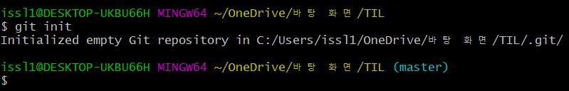

# Git command

> Git 명령어 정리

## 초기설정

### 0. init

- `git init`

- `.git/ ` 폴더를 생성 해준다.

- `.git`폴더가 생성된 경우 오른쪽에 `master`라는 포시가 나온다.
- 폴더당 최초의 한번만 적용하면 된다.
- `Initialized empty Git repository in C:/Users/issl1/OneDrive/바탕 화면/Git/.git/`
- " Git 이라는 해당폴더에 새로은 레포지토리가 생겼습니다. "
- 

### 1. config

- `git config --global user.email "myemail@gmail.com"`
  - 이메이플의 경우 Github에 올릴경우 잔디가 심어지는 기준이므로 정확한 입력 필요.
- `git config --global user.name "myname"`
- 최초의 한번만 하면 된다.

## 커밋기록

### 1. add

- `git add <추가하고싶은 파일>`
  - `git add .` : 현재 폴더의 모든 파일과 폴더를 add
- working directory => staging area 로 파일 이동

### 2. commit

- `git commit -m "message"`
- 스냅샷을 찍는 동작
- add 되어있는 하나의 묶음으로 저장

- 메세지에 들어가는 내용은 기능 단위로 작성

### 3. remote

- `git remote add origin "adress"`
- ''깃아 / 원격저장소를 / 등록할건데 / 별명은 origin으로 해주고 / 원래 주소는 이거야''
- 원격 저장소와 현재 로컬 저장소를 연결
- 한 레퍼지토리 당 한번만 연결하면 된다.

### 4. push

- `git push origin master`
- ''깃아 / 푸쉬해서;데이터 전송해줘 / 어디로;origin이라는 주소로 / 뭐뭐를;master라고 하는 줄기를''
- 원격저장소에 로컬 저장소의 데이터를 전송

### 5. clone

- `git clone "adress"`
- "깃아 복제해줘 해당 주소에 있는 데이터를"
- 원격저장소에 있는 데이터를 로컬 저장소로 복제

### 6. pull

- `git pull origin master`
- 원격저장소에 있는 데이터를 기존의 로컬저장소로 Update
- push와 상반된 개념

## 상태확인

### 1. status

- `git status`
- 현재 git 상태를 출력

### 2. log

- `git log`
- 커밋 기록 전체를 출력
- 옵션
  - `--oneline`  : author, date 같은 정보를 제외하고 한줄로 출력
  - `--graph` : 커밋들을 점으로 표현하고 그 커밋을 선으로 연결해서 그래프 형태로 출력

### 3. diff

- `git diff`
- 현재 변경사항을 체크 (add 하기전에 사용)

## 추가파일

### 1. gitignore

- `.gitignore` 파일을 생성 후 git으로 관리하고 싶지 않은 파일들을 저장
- [gitignore.io]() 사이트에서 활용

## 브랜치

### 1. branch

> #### 생성

- `git branch 'leejoonghyun'`
  - 새로운 branch 'leejoonghyun'을 추가 

- `git branch`
  - 현재 branch 확인

- 주로 기능별로 이름을 생성

- `git branch -M main`
- master인 관리자의 이름을 main으로 변경
- 사회운동 영향으로 인하여 반영됨

### 2. switch (구 checkout)

> #### 이동

- `git switch 'leejoonghyun'`
- 현재 위치한 branch를 'leejoonghyun' 으로 변경

### 3. merge

> #### 합병

- `git merge '가고자 하는 branch'`
- 'master' branch와 'leejoonghyun' 를 합치는 과정
- base가 되는 branch로 이동하여 사용

- 충돌이 발생한 경우 ==> 충돌을 해결하고 다시 add, commit, push 과정 반복

### 4. branch "-D"

> #### 삭제

- `git branch -D 'leejoonghyun'`
  - 합친 후 쓸모없게된 branch를 제거

